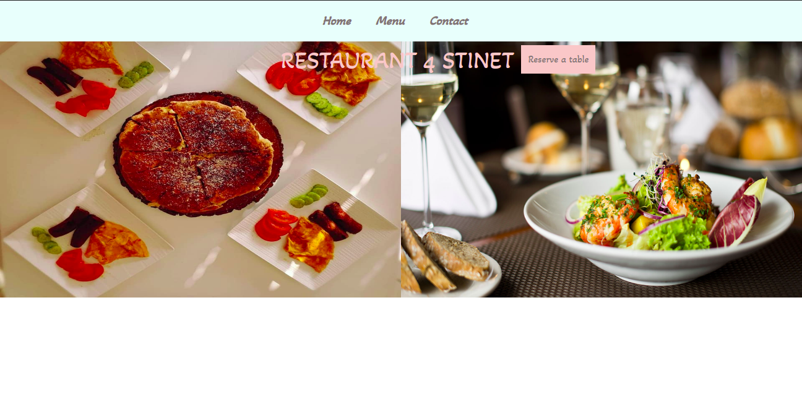

# Restaurant-page

This project project is part of Microverse learning and here I created dynamic restaurant website. This projet was created only with javascript and it does not need any kind of browser to render the pages.

## Built With 

- Javacript
- Bootstrap
- HTML
- CSS
- WEBPACK
- NPM

## Install 

> In order to install this project please follow the next steps:

1. - [ ] Open the `Terminal`
2. - [ ] Navigate to the directory where you want to add this repository
3. - [ ] Run `git clone git@github.com:GzimAsani/Restaurant-page.git` or with HTTP`git clone https://github.com/GzimAsani/Restaurant-page.git` 
4. - [ ] 
5. - [ ] Run `npm install` to install the necessary modules

## Author

👤 **Gzim Asani**
- Github: [@GzimAsani](https://github.com/GzimAsani)
- Linkedin: [GzimAsani](https://www.linkedin.com/in/gzim-asani-83390a17a/)

## 🤝 Contributing

Contributions, issues and feature requests are welcome!

Feel free to check the [issues page](https://github.com/Div685/JS-Library/issues).

## Show your support

Give a ⭐️ if you like this project!